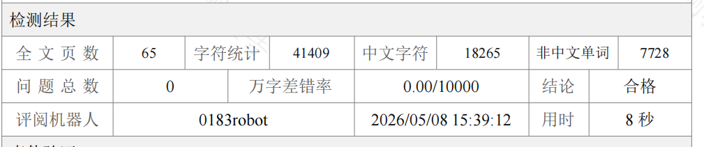

# NCUT 2026 本科毕业设计（论文）LaTeX 模板

本模板基于北方工业大学 2026 版《本科生学士学位论文（毕业设计）写作规范》制作。旨在帮助同学们快速、规范地排版毕业论文，省去在 Word 中反复调整格式的烦恼。

## 格式检测通过证明

本模板已经过学校指定的格式检测系统（如 0183robot）严格测试，**问题总数和万字差错率均为 0（完美通过）**，各项格式如字体、字号、页眉、段落间距、图表编号、参考文献缩进等均符合最新规范。



## 文件结构说明

- `ncut-thesis.cls`：模板核心类文件，定义了所有的格式规范，**一般不需要修改**。
- `main.tex`：论文主控文件，包含个人信息配置和章节引入。
- `references.bib`：参考文献数据库，使用标准的 BibTeX 格式。
- `cover.pdf`：封面和原创性声明页（2页），由 Word 导出后替换。
- `chapters/`：论文的各个章节源文件。
- `figures/`：存放论文中用到的图片。

## 封面与原创性声明的处理（重要！）

由于学校的封面和原创性声明表格在 LaTeX 中完美复刻较为困难，且通常需要签字，本模板采用**外部 PDF 拼接**的方式：

1. 打开学校下发的官方 Word 模板。
2. 在前两页（封面和原创性声明）填写好你的个人信息（题目、姓名、学号等）。
3. 将填好的前两页导出或打印为 PDF 文件，命名为 `cover.pdf`。
4. 将该 `cover.pdf` 放到本模板的根目录下（替换自带的占位文件）。
5. 编译时，LaTeX 会自动将这 2 页作为论文的第 1、2 页拼接到最终生成的 PDF 中。

## 编译方法

推荐使用 **XeLaTeX** 进行编译。如果使用 VSCode 的 LaTeX Workshop 插件，请确保默认的编译链工具包含 `xelatex`。

在命令行中，可以直接使用 `latexmk` 一键编译：

```bash
latexmk -xelatex main.tex
```

## 注意事项

- **参考文献**：本模板采用 `biblatex` 和 `gb7714-2015` 样式。请在 `references.bib` 中按照规范录入文献信息，模板会自动处理悬挂缩进和引用的格式。
- **图表编号**：图表编号会自动按照“章节号.序号”的方式生成（如 图1.1，表2.3），符合最新规范要求。
- **字体支持**：本模板依赖于系统的中文字体（如黑体、宋体等）。请确保你的操作系统中安装了相应的基本中文字体。

祝大家毕业顺利！

## 环境配置与安装指南

为了顺利编译本模板，你需要安装 **LaTeX 发行版**（提供底层的编译引擎，如 xelatex）以及一个 **LaTeX 编辑器**（推荐使用 VSCode）。

### 第一步：安装 LaTeX 发行版

**Windows 用户：**
推荐安装 **TeX Live**（包含最全的宏包，免去缺包烦恼）。
1. 访问清华大学开源软件镜像站：[TeX Live 镜像](https://mirrors.tuna.tsinghua.edu.cn/CTAN/systems/texlive/Images/)。
2. 下载 `texlive.iso` 文件（约 5GB）。
3. 右键该 iso 文件，选择“装载”（或使用虚拟光驱打开）。
4. 右键以管理员身份运行 `install-tl-windows.bat`。
5. 在弹出的安装向导中，一路点击“下一步/Next”完成安装（安装过程可能需要 30 分钟以上，请耐心等待）。

**macOS 用户：**
推荐安装 **MacTeX**。
1. 访问清华大学开源软件镜像站：[MacTeX 镜像](https://mirrors.tuna.tsinghua.edu.cn/CTAN/systems/mac/mactex/)。
2. 下载 `MacTeX.pkg` 文件。
3. 双击 pkg 文件，按照系统提示的安装向导完成安装即可。

### 第二步：安装与配置编辑器 (VSCode)

强烈推荐使用 **Visual Studio Code (VSCode)** 作为论文的编写工具，它轻量且插件生态强大。

1. **下载安装 VSCode**：前往 [VSCode 官网](https://code.visualstudio.com/) 下载并安装。
2. **安装核心插件**：
   - 打开 VSCode，点击左侧边栏的“扩展 (Extensions)”图标。
   - 搜索并安装 **`LaTeX Workshop`** 插件（作者为 James-Yu）。
3. **配置编译链（一键编译）**：
   - 按下 `Ctrl + Shift + P` (Windows) 或 `Cmd + Shift + P` (Mac)，输入 `Open Settings (JSON)`，打开设置文件。
   - 在配置文件中添加以下关于 `latexmk` 的配置（本模板依赖 `xelatex` 编译）：

```json
"latex-workshop.latex.recipes": [
    {
        "name": "latexmk 🔃",
        "tools": [
            "latexmk"
        ]
    }
],
"latex-workshop.latex.tools": [
    {
        "name": "latexmk",
        "command": "latexmk",
        "args": [
            "-xelatex",
            "-synctex=1",
            "-interaction=nonstopmode",
            "-file-line-error",
            "%DOC%"
        ]
    }
]
```

### 第三步：开始编写与编译

1. 在 VSCode 中打开本模板的文件夹。
2. 打开 `main.tex` 文件。
3. 点击 VSCode 侧边栏的 **TEX** 图标，在“Build LaTeX project”菜单中点击 **`latexmk 🔃`**，即可实现一键编译（或者直接按 `Ctrl+Alt+B` / `Cmd+Option+B`）。
4. 编译成功后，点击右上角的“View LaTeX PDF”图标，即可在右侧分屏实时预览排版效果。

## 格式检测平台上传说明

当你的论文使用本模板编译完成，需要提交至学校的格式检测平台验证时，请注意以下事项：

1. **检测系统网址**：[https://ncut.lun51.com/jwc](https://ncut.lun51.com/jwc)
2. **上传格式要求**：检测系统**不支持直接上传 PDF 文件**进行检测。你需要将编译好的 `main.pdf`（或你重命名的最终版 PDF）压缩成 **ZIP 格式的压缩包**。
3. **操作步骤**：
   - 确保 `latexmk` 编译成功且生成了最新的 PDF。
   - 右键该 PDF 文件，选择“压缩”为 `.zip` 文件。
   - 登录上述检测系统网址，上传该 ZIP 压缩包即可获取详细的格式诊断报告（若按本模板正确书写，问题总数应为 0）。

## 常见问题与字体配置

### 跨平台字体问题 (Windows/macOS)

为了保证论文在不同操作系统下都能正确编译并显示正确的中文字体，本模板的 `ncut-thesis.cls` 中内置了**跨平台字体自动检测逻辑**：

- **macOS 环境**：模板会自动检测系统字体路径，并使用 macOS 原生的 `Songti SC`、`Heiti SC`、`Kaiti SC` 和 `STFangsong` 进行排版。
- **Windows 环境**：模板会自动回退使用 Windows 原生的中易字体集：`SimSun` (宋体)、`SimHei` (黑体)、`KaiTi` (楷体) 和 `FangSong` (仿宋)。

**⚠️ Windows 用户注意事项：**
如果你的电脑是新安装的 Windows 系统，或者精简版系统，可能会缺失部分默认的中易字体（尤其是**楷体(KaiTi)**和**仿宋(FangSong)**）。
如果在编译时看到类似 `Font "KaiTi" does not contain requested Script "CJK"` 或 `找不到中文字体` 的报错，请：
1. 检查 `C:\Windows\Fonts` 目录下是否包含**楷体**和**仿宋**。
2. 如果没有，请在网上下载标准的 `simkai.ttf` (楷体) 和 `simfang.ttf` (仿宋)，右键选择“为所有用户安装”。
3. 重新运行 `latexmk` 编译即可解决。
